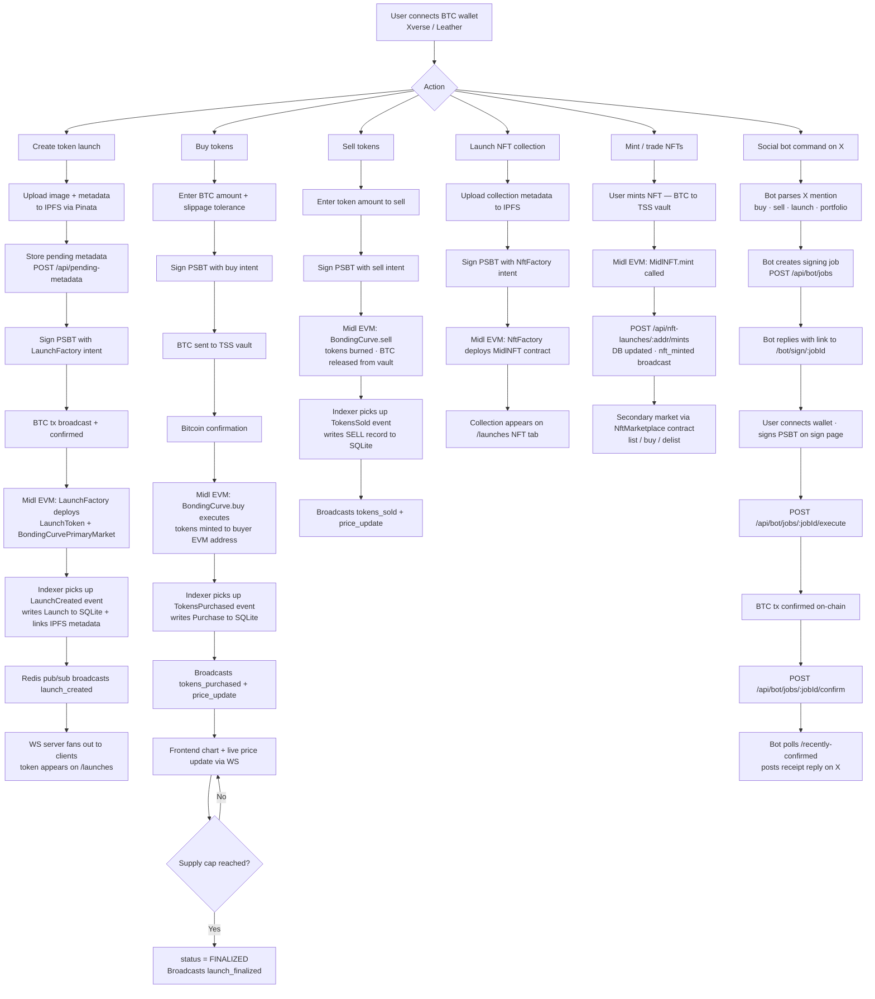

# MidlLaunch — Bitcoin-Native Token Issuance Protocol

**Status:** Full-stack complete · Deployed on Midl Staging · PRD v1.3 compliant

## What is MidlLaunch?

A pump.fun-style bonding curve launchpad on Bitcoin L2 (Midl Network). Create fungible tokens or NFT collections, trade with BTC, and watch prices rise with every purchase — all settled on Bitcoin.

**In scope (v1):**
- Buy-side and sell-side linear bonding curve — deterministic, on-chain pricing
- Bitcoin-native settlement — sign with Xverse wallet
- Trust-minimized via Midl validators and TSS vaults
- NFT collection launches with per-mint BTC pricing
- NFT secondary marketplace (list, buy, delist)
- Non-custodial social trading bot (@midllaunchbot on X)

**Out of scope (per PRD):**
- AMM or liquidity migration
- Anti-bot or fairness mechanisms

---

## End-to-End Lifecycle



---

## Deployed Contracts (Midl Staging)

| Contract | Address |
|----------|---------|
| LaunchFactory | `0x25FE7EF91B9C4c79f1Ad46b7419d9db935ee24b1` |
| NftFactory | `0x06b81d8607E2C984513A763206B80048A9d584F8` |
| NftMarketplace | `0x9E312623C309d749Ceb50a954E0094502808288d` |

**LaunchFactory**
- Blockscout: https://blockscout.staging.midl.xyz/address/0x25FE7EF91B9C4c79f1Ad46b7419d9db935ee24b1
- EVM tx: https://blockscout.staging.midl.xyz/tx/0x2cd78eb98510db3f657776994573af16d1fc16b7014a960a09b511835d8bb0e2
- BTC tx: https://mempool.staging.midl.xyz/tx/e74a36d440506c651d1ef72b2f92d108b85af24f5b32ac578ea822f5a420ef60

**NftFactory**
- Blockscout: https://blockscout.staging.midl.xyz/address/0x06b81d8607E2C984513A763206B80048A9d584F8
- EVM tx: https://blockscout.staging.midl.xyz/tx/0x2997b0fcb5228333064f7923fad704a89b077c18cafb68aae89735f8e880fb63
- BTC tx: https://mempool.staging.midl.xyz/tx/afb2b58aa7fb6a0896eb9bcf1fc32e9d484706ecc09de82da52aa70eea68e93b

**NftMarketplace**
- Blockscout: https://blockscout.staging.midl.xyz/address/0x9E312623C309d749Ceb50a954E0094502808288d
- EVM tx: https://blockscout.staging.midl.xyz/tx/0x4138c73037fd55e70902ba3b8d93b92537f347592c9416968395c9797658ac1a
- BTC tx: https://mempool.staging.midl.xyz/tx/ab19c2305f9072bb8e6eb82ca3ead941d0f80dd5cc660b414a6f339736610fe6

---

## Quick Start

### Prerequisites

- Node.js 18+
- Redis instance
- Midl staging RPC access

### 1. Contracts

```bash
npm install
npm test                    # Run 24 contract tests
npm run compile             # Compile Solidity
npm run deploy:staging      # Deploy to Midl staging
```

After deploy, `deployments/env-update.txt` contains ready-to-paste env snippets for backend and frontend.

### 2. Backend

```bash
cd backend
npm install
npx prisma migrate dev      # Run DB migrations (SQLite)
npm run dev                 # Start API on :4000 + WebSocket on :8080
```

### 3. Frontend

```bash
cd frontend
cp .env.local.example .env.local   # Fill in addresses + API URL
npm install
npm run dev                         # Start Next.js on :3002
```

---

## Smart Contracts

### BondingCurvePrimaryMarket

- **Linear price:** `P(s) = basePrice + s × priceIncrement`
- **Closed-form buy math (Appendix A):** Babylonian sqrt — no loops, O(1) gas
- **Supply cap pre-check:** buy() reverts before execution if purchase would exceed cap
- **Gas cost:** ~200–300k per purchase
- **Slippage protection:** `minTokensOut` parameter

**Parameter bounds (factory-enforced):**

| Parameter | Min | Max |
|-----------|-----|-----|
| Base Price | 1,000 sats | 1,000,000 sats |
| Price Increment | 1 sat | 10,000 sats |
| Supply Cap | 1M tokens | 21M tokens |

### MidlNFT

- ERC721URIStorage + Ownable + ReentrancyGuard
- Fixed mint price in sats, per-wallet cap, max supply enforcement
- `mint()` is `nonReentrant`; overpayment refunded to caller; creator receives exact `mintPrice × quantity` via `call`
- Token URI resolves to `ipfs://{collectionMetadataCID}/{tokenId}.json`

### NftMarketplace

- List, buy, delist secondary market for any MidlNFT collection
- Strict payment enforcement: `msg.value == listing.priceSats` (no overpay)
- Seller receives exact listing price via `call`
- ReentrancyGuard on `buy()`

### Test Coverage (24 tests)

Supply cap enforcement · Monotonic price · Slippage protection · Parameter bounds · Event completeness (intentId) · Unauthorized mint protection · Gas O(1) · Admin scoping · Audit fix regressions

---

## Backend API

REST API served at `http://localhost:4000`.

**Token launches:**

| Endpoint | Description |
|----------|-------------|
| `GET /api/launches` | List launches (filter by status, sort, paginate) |
| `GET /api/launches/trending` | Trending launches by score |
| `GET /api/launches/graduating` | Launches near 100% supply |
| `GET /api/launches/search` | Full-text search |
| `GET /api/launches/:address` | Launch detail |
| `GET /api/launches/:address/purchases` | Purchase history |
| `GET /api/launches/:address/price-history` | OHLC price points |
| `GET /api/launches/:address/chart` | Chart data |
| `GET /api/launches/:address/comments` | Comments |
| `POST /api/launches/:address/comments` | Post a comment |
| `PATCH /api/launches/:address/metadata` | Update metadata (CID, socials) |
| `POST /api/launches/:address/graduate` | Trigger graduation |
| `POST /api/pending-metadata` | Store pending metadata pre-launch |

**NFT launches:**

| Endpoint | Description |
|----------|-------------|
| `GET /api/nft-launches` | NFT collection list |
| `GET /api/nft-launches/:address` | Collection detail |
| `GET /api/nft-launches/:address/mints` | Mint history |
| `POST /api/nft-launches/:address/mints` | Record a mint |
| `PATCH /api/nft-launches/:address/metadata` | Update collection metadata |

<br />

### 🔒 Mutating Endpoints (Authentication Required)

To prevent unauthorized modifications to the PostgreSQL database, all HTTP routes that update metadata or submit comments require a mathematically verifiable Bitcoin signature.

You do not need a session cookie or an API key. Instead, whenever you send a `PATCH` or a `POST` request, you must append an `auth` object to your JSON body containing a signature generated by your Bitcoin wallet (e.g. Unisat, Xverse, Leather).

**Required Payload Format:**
```json
{
  "auth": {
    "address": "bc1q...",
    "message": "I am the creator of [tokenAddress]",
    "signature": "H8yAIxMVQfVcY4J..." // Base64 signature
  }
}
```

#### How it works:
1. **Metadata Updates (`PATCH /api/launches/:address/metadata` & `PATCH /api/nft-launches/:address/metadata`):** The signature is recovered and its address must perfectly match the `creatorAddress` of the Launch on record.
2. **Comment Posting (`POST /api/launches/:address/comments`):** The signature is recovered and must match the `author` field sending the comment.

#### Example: Testing via cURL
You can test these endpoints without the frontend UI by using your wallet's built-in "Sign Message" tool.
1. Open your Bitcoin wallet extension (e.g., Unisat).
2. Look for **"Sign Message"** in the Settings.
3. Type a message, e.g., `"Update my token"`, and click **Sign**.
4. Copy the resulting Base64 Signature string.

```bash
curl -X PATCH http://localhost:4000/api/launches/YOUR_TOKEN_ADDRESS/metadata \
     -H "Content-Type: application/json" \
     -d '{
       "twitterUrl": "https://x.com/newlink",
       "auth": {
         "address": "YOUR_WALLET_ADDRESS",
         "message": "Update my token",
         "signature": "PASTE_THE_SIGNATURE_HERE"
       }
     }'
```

**User:**

| Endpoint | Description |
|----------|-------------|
| `GET /api/user/:address/holdings` | Portfolio holdings + P&L |
| `GET /api/user/:address/activity` | Full activity (purchases, launches created, NFT mints) |

**Platform:**

| Endpoint | Description |
|----------|-------------|
| `GET /api/activity` | Global activity feed (last 50 buys) |
| `GET /api/stats` | Platform stats |
| `GET /health` | Health check |

**Bot:**

| Endpoint | Description |
|----------|-------------|
| `POST /api/bot/link-wallet` | Link X handle to EVM address |
| `GET /api/bot/wallet/:xHandle` | Look up wallet for X handle |
| `POST /api/bot/jobs` | Create signing job |
| `GET /api/bot/jobs/:jobId` | Get job status |
| `PATCH /api/bot/jobs/:jobId` | Update job |
| `POST /api/bot/jobs/:jobId/execute` | Execute job after signing |
| `POST /api/bot/jobs/:jobId/confirm` | Confirm job on-chain |
| `POST /api/bot/jobs/:jobId/mark-replied` | Mark bot reply sent |
| `POST /api/bot/jobs/:jobId/mark-expiry-replied` | Mark expiry reply sent |
| `GET /api/bot/jobs/recently-confirmed` | Recently confirmed jobs |
| `GET /api/bot/jobs/recently-expired` | Recently expired jobs |
| `POST /api/bot/jobs/expire-old` | Expire stale jobs |
| `GET /api/bot/stats` | Bot stats |

**WebSocket** (port 8080): broadcasts `launch_created`, `tokens_purchased`, `tokens_sold`, `price_update`, `comment_posted`, `launch_finalized`, `nft_minted` events.

---

## Frontend Pages

| Route | Description |
|-------|-------------|
| `/` | Hero, platform stats, trending tokens, live activity feed, NFT teaser |
| `/launches` | Browse tokens + NFT collections — hero carousel, sort/filter, live search |
| `/launch/[address]` | Token detail: bonding curve chart, price history, buy/sell widget, trade history, comments |
| `/nft/[address]` | NFT collection: mint panel, your-NFTs gallery, secondary market listings |
| `/create` | Create token launch — IPFS metadata upload, curve parameters |
| `/launch-nft` | Create NFT collection launch |
| `/portfolio` | Holdings with unrealized P&L and full activity history |
| `/transactions` | Transaction lifecycle tracker |
| `/my-tokens` | Token launches created by connected wallet, with live stats |
| `/referral` | Referral link sharing (wallet address as referral ID) |
| `/bot/sign/[jobId]` | Wallet signing page for bot-initiated transactions |
| `/bot-demo` | Interactive bot demo |
| `/link-x` | Link X (Twitter) account to wallet address |
| `/how-it-works` | Protocol documentation — execution model, settlement mechanics, trust assumptions |
| `/terms` | Terms of service |
| `/privacy` | Privacy policy |
| `/risk-disclosure` | Risk disclosure |

**Key features:**
- Real-time buy feed via WebSocket
- Bonding curve SVG chart + price history line chart (5m / 1h / 4h / 1d intervals)
- One-click BTC purchase and sell via SatoshiKit (supports Xverse, Leather, and other BTC wallets)
- Live activity ticker in header
- Toast notifications for all user actions
- Canvas-confetti on token graduation (100% supply sold)
- Page transition animations
- Mobile-first with bottom navigation bar and sidebar
- IPFS/Pinata image upload in create forms
- First-visit disclaimer modal (localStorage-gated)

---

## Tech Stack

| Layer | Technology |
|-------|-----------|
| Smart contracts | Solidity ^0.8.24, Hardhat, OpenZeppelin |
| Backend | Express.js, SQLite (local) / PostgreSQL (prod), Prisma ORM, Redis, Zod |
| Frontend | Next.js 14 (App Router), React 18, TypeScript |
| Styling | Tailwind CSS, CSS custom properties (design tokens) |
| Data fetching | TanStack Query v5 |
| Wallet | @midl/satoshi-kit, @midl/react, @midl/executor-react |
| Images | next/image with Pinata/IPFS remote patterns |

---

## Environment Variables

**Backend** (`backend/.env`):

```
DATABASE_URL="file:./prisma/dev.db"
MIDL_RPC_URL=https://rpc.staging.midl.xyz
FACTORY_ADDRESS=0x25FE7EF91B9C4c79f1Ad46b7419d9db935ee24b1
NFT_FACTORY_ADDRESS=0x06b81d8607E2C984513A763206B80048A9d584F8
NFT_MARKETPLACE_ADDRESS=0x9E312623C309d749Ceb50a954E0094502808288d
REDIS_URL=redis://localhost:6379
PORT=4000
WS_PORT=8080
CORS_ORIGIN=http://localhost:3002
START_BLOCK=0
POLL_INTERVAL_MS=5000
```

**Frontend** (`frontend/.env.local`):

```
NEXT_PUBLIC_API_URL=http://localhost:4000
NEXT_PUBLIC_WS_URL=ws://localhost:8080
NEXT_PUBLIC_APP_URL=http://localhost:3002
NEXT_PUBLIC_MIDL_RPC_URL=https://rpc.staging.midl.xyz
NEXT_PUBLIC_LAUNCH_FACTORY_ADDRESS=0x25FE7EF91B9C4c79f1Ad46b7419d9db935ee24b1
NEXT_PUBLIC_NFT_FACTORY_ADDRESS=0x06b81d8607E2C984513A763206B80048A9d584F8
NEXT_PUBLIC_NFT_MARKETPLACE_ADDRESS=0x9E312623C309d749Ceb50a954E0094502808288d
PINATA_API_KEY=
PINATA_SECRET=
```

---

## Deployment

See **[docs/DEPLOYMENT.md](./docs/DEPLOYMENT.md)** for full staging deployment guide.

```bash
# Deploy contracts (writes deployments/env-update.txt with addresses)
npm run deploy:staging

# Start backend
cd backend && npm run start

# Build + start frontend
cd frontend && npm run build && npm run start
```

---

## Security & Trust Model

- **Trust-minimized** (not trustless): Midl validators control TSS vaults
- **On-chain guarantees**: supply cap, price monotonicity, parameter bounds, reentrancy protection — all enforced in Solidity
- **Off-chain trust**: frontend data accuracy, indexer availability, metadata correctness
- **Bitcoin finality**: settlement requires N BTC confirmations before Midl execution
- **Audit fixes applied**: supply cap pre-check in buy(), strict payment in NftMarketplace, nonReentrant on MidlNFT.mint(), overpayment refunds, `call` instead of `transfer` throughout

---

## Running MidlLaunchBot

### Prerequisites
1. Sign up at developer.x.com
2. Create a project and app
3. Generate OAuth 1.0a keys (API Key, API Secret, Access Token, Access Token Secret)
4. Purchase X API credits ($20 is enough to start — pay-per-use, no subscription)
5. Enable auto-recharge at $5 threshold in Developer Console to avoid interruption

### Setup
```bash
cp bot/.env.example bot/.env
# Fill in X_API_KEY, X_API_SECRET, X_ACCESS_TOKEN, X_ACCESS_TOKEN_SECRET
```

### Run
```bash
npm run bot
```

### Cost estimate
At 100 commands/month:
- 100 posts read x $0.005 = $0.50
- 100 replies x $0.010 = $1.00
- Total: ~$1.50/month

### Architecture — Why Non-Custodial Is Better

Most social trading bots are custodial: they hold your private keys and sign on your behalf.
MidlLaunchBot is different.

**The flow:**
1. You send a command on X
2. Bot creates a signing request and replies with a link
3. You tap the link — your Xverse wallet signs the actual Bitcoin PSBT
4. Bot posts the on-chain proof once confirmed

**Why this matters:**
- Your keys never leave your wallet
- The bot cannot move your funds without your signature
- Every transaction is verifiable on Bitcoin mempool + Midl Blockscout
- If the bot is compromised, no user funds are at risk

"We built non-custodial social trading on a Bitcoin L2.
The bot routes intent. The wallet signs. The chain proves."

### Supported commands (tag @midllaunchbot)

All commands are fully integrated end-to-end — parsed from mentions, dispatched to signing flow, confirmed on-chain, proof posted as reply.

| Command | What happens |
|---------|-------------|
| `@midllaunchbot buy $TOKEN 0.001 BTC` | Bot estimates tokens, sends signing link. User signs → BTC sent to bonding curve → tokens minted. Bot replies with proof. |
| `@midllaunchbot buy $TOKEN 100000 sats` | Same as above with sats denomination. |
| `@midllaunchbot sell $TOKEN 50%` | Bot calculates 50% of holdings, estimates BTC return, sends signing link. User signs → tokens burned → BTC returned. Bot replies with proof. |
| `@midllaunchbot sell $TOKEN all` | Sell 100% of holdings. |
| `@midllaunchbot launch MyToken ($MYT)` | Bot creates a launch job with defaults (1M supply, 1000 sat base price, 100 sat increment). User signs → token deployed via LaunchFactory. Bot replies with token address and trade link. |
| `@midllaunchbot portfolio` | Bot looks up holdings and replies with top 3 positions + total BTC value. No signing required. |
| `@midllaunchbot link` | Bot replies with link to `/link-x` to connect X handle → wallet address. No signing required. |
| `@midllaunchbot help` | Bot replies with command list. |

**Bot launch defaults** (when launching via bot — full config available on `/create`):
- Supply cap: 1,000,000 tokens
- Base price: 1,000 sats
- Price increment: 100 sats per token sold
- Creator fee: 0%

---

## License

ISC
